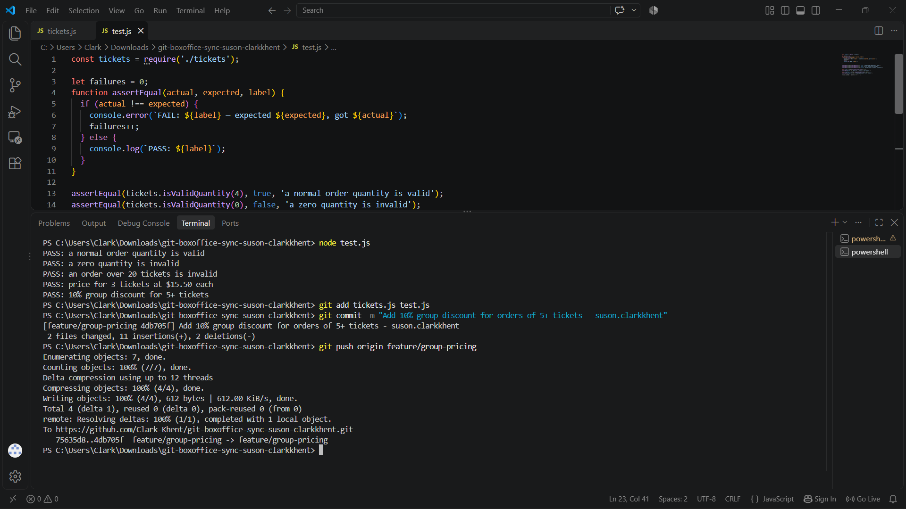
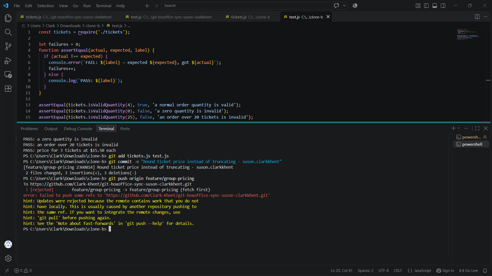
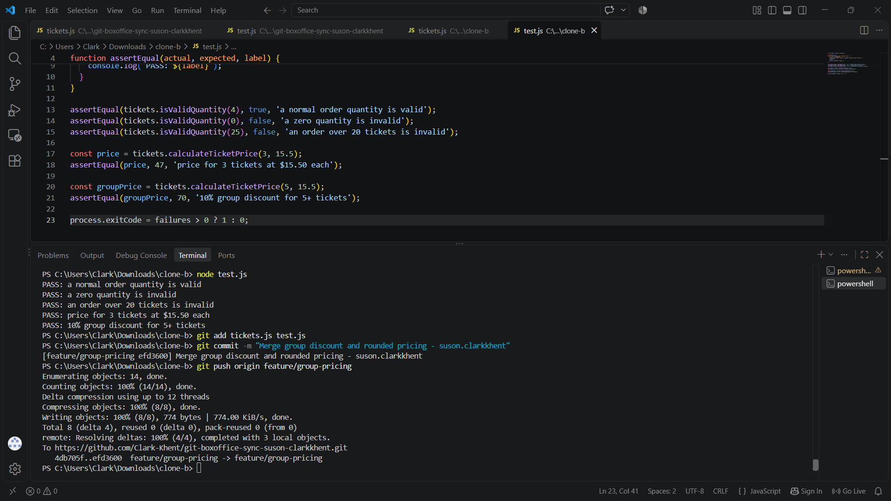
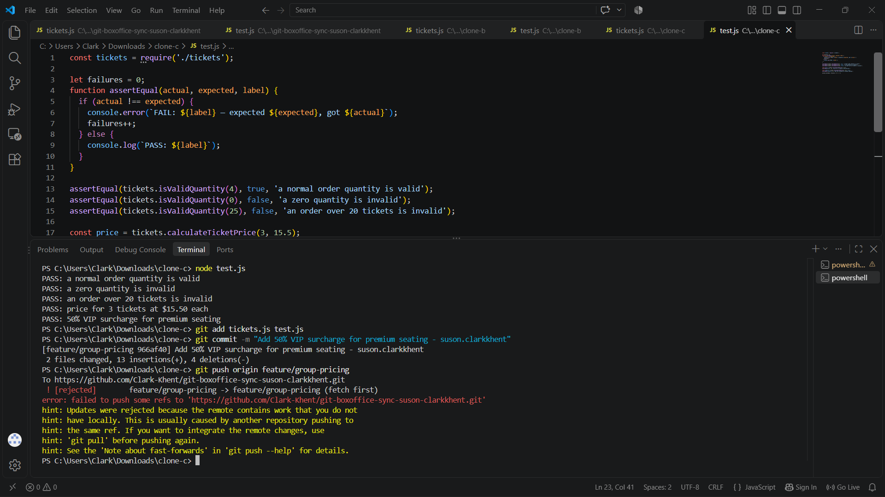
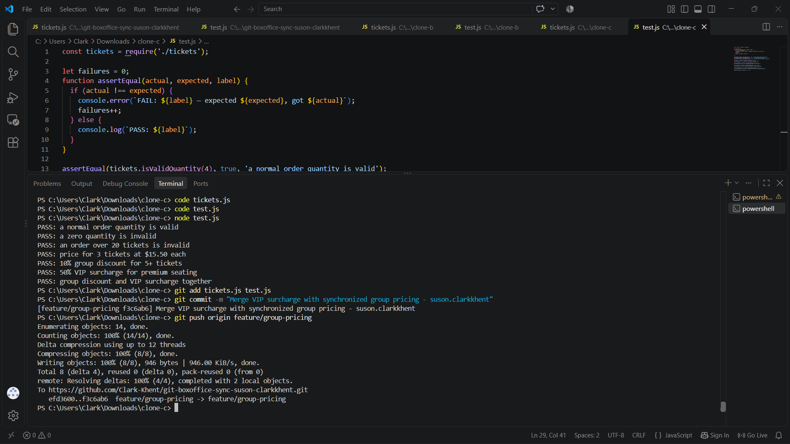
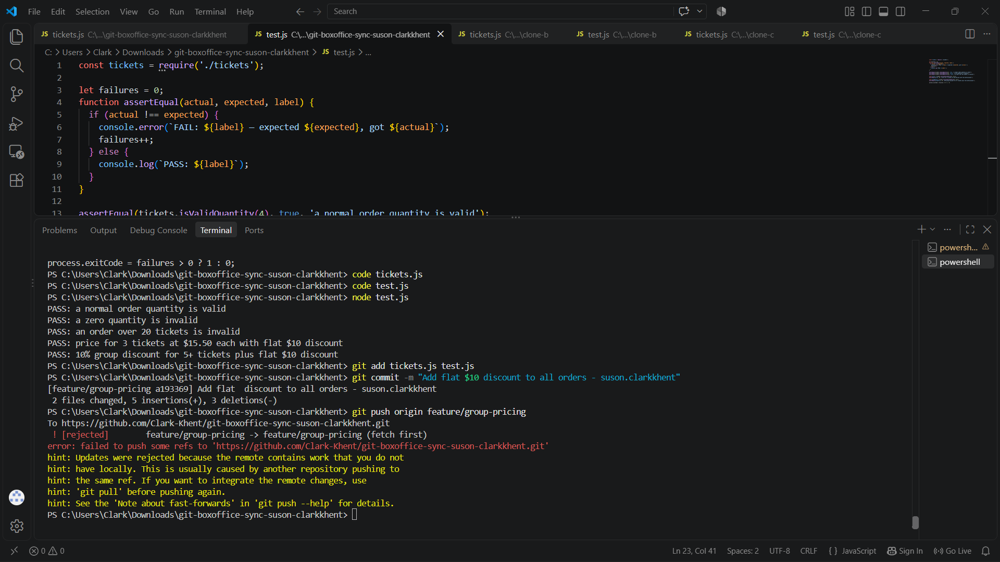
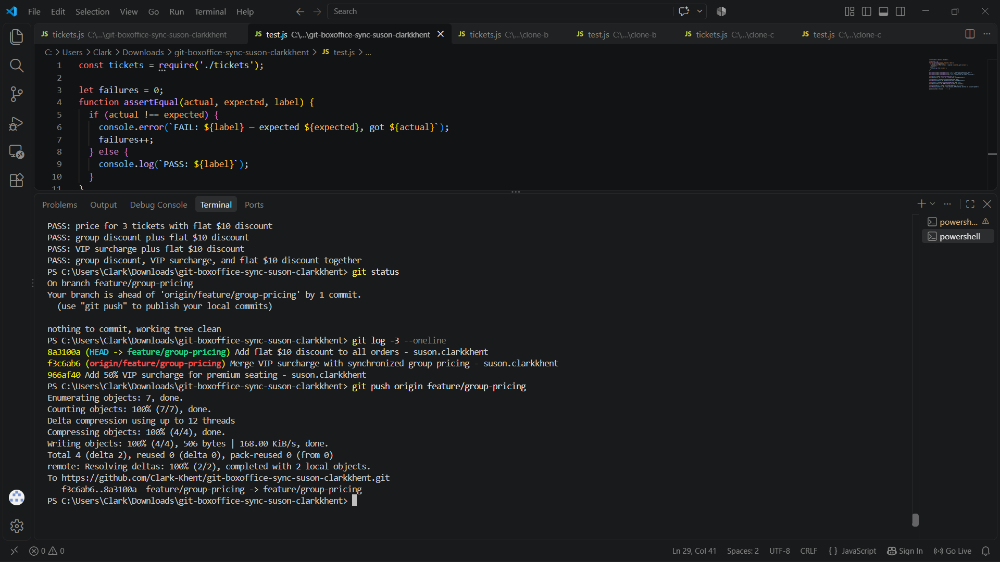
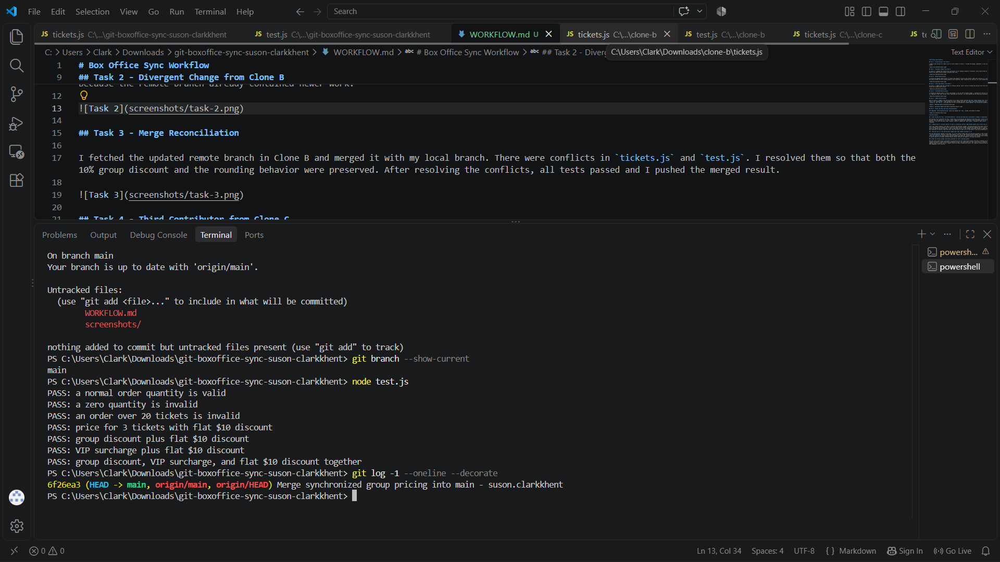

# Box Office Sync Workflow

## Task 1 - Group Discount from Clone A

I added a 10% discount for orders with 5 or more tickets in Clone A. I tested the change, committed it, and successfully pushed it to the `feature/group-pricing` branch.

## Task 2 - Divergent Change from Clone B

In Clone B, I changed the ticket price calculation to use rounding instead of truncation. Since Clone B had not fetched Clone A's previous push, my push was rejected because the remote branch already contained newer work.

## Task 3 - Merge Reconciliation

I fetched the updated remote branch in Clone B and merged it with my local branch. There were conflicts in `tickets.js` and `test.js`. I resolved them so that both the 10% group discount and the rounding behavior were preserved. After resolving the conflicts, all tests passed and I pushed the merged result.

## Task 4 - Third Contributor from Clone C

In Clone C, I added a 50% VIP surcharge for premium seating. Clone C had not fetched the previous work from Clones A and B, so the push was rejected because the remote branch had already moved forward.

## Task 5 - Three-Way Reconciliation

I fetched the updated branch in Clone C and merged it with the VIP surcharge change. I resolved the conflicts so that the group discount, rounding, and VIP surcharge all remained in the final version. After resolving the conflicts, all tests passed and the branch was successfully pushed.

## Task 6 - Rebase Reconciliation

Back in Clone A, I added a flat $10 discount to all orders without fetching the newer remote changes first. My push was rejected because the branch had changed since Clone A last synchronized. I then fetched the latest changes and used `git rebase origin/feature/group-pricing` instead of a merge. I resolved the conflicts in both `tickets.js` and `test.js`, confirmed that all four pricing behaviors worked together, and successfully pushed without using force.

## Task 7 - Merge into Main and Final Synchronization

The completed `feature/group-pricing` branch was merged into `main`, tested, and pushed to GitHub.

# Written Answers

## 1. Walk through the final `calculateTicketPrice` function and name which contributor's change is responsible for each part.

The function first calculates the basic ticket total by multiplying the quantity by the base price. Clone A's first change added the condition that gives a 10% discount when the quantity is 5 or more. Clone C added the premium-seat condition, which increases the current total by 50% for VIP seating. Clone A's Task 6 change subtracts a flat $10 from every order. Finally, Clone B's change uses `Math.round()` instead of `Math.floor()`, so the final calculated amount is rounded rather than truncated.

## 2. Compare Task 3's two-way conflict to Task 5's three-way conflict. What became harder with a third line of work?

Task 3 was simpler because I only had to reconcile two different changes: the group discount from Clone A and the rounding change from Clone B. In Task 5, Clone C was still working from the original version while the remote branch already contained the combined work of A and B. This meant I had to preserve two existing behaviors while also adding the VIP surcharge. I had to understand how all of the changes interacted instead of simply deciding between two versions of the same code. It became more important to manually check the final logic and tests to make sure no contributor's work was accidentally removed.

## 3. Why did Task 6's flat $10 discount change tests that seemed unrelated to it?

The flat $10 discount applies to any order, so it also affects orders that use the group discount or VIP surcharge. Those tests still call the same `calculateTicketPrice` function, which means adding a new rule to that shared function changes their final expected results as well. For example, the group-discount result now receives the group discount and then another $10 reduction. The VIP result also receives the surcharge and then the $10 reduction. This shows that changes in shared code are not always isolated because several features can depend on the same calculation.

## 4. What one process change could have prevented all three rejected pushes?

The team could require every contributor to synchronize with the remote branch before starting or pushing new work. Each contributor should fetch the newest remote changes and merge or rebase them before attempting to push. This would make sure their local branch is based on the newest shared history. In a real team, using separate feature branches and pull requests would also make collaboration easier, but regularly synchronizing before pushing would directly prevent the rejected pushes that happened in this activity.